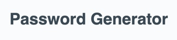
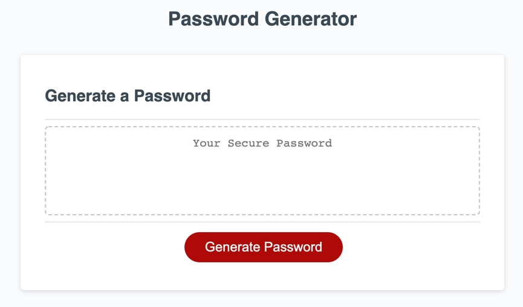
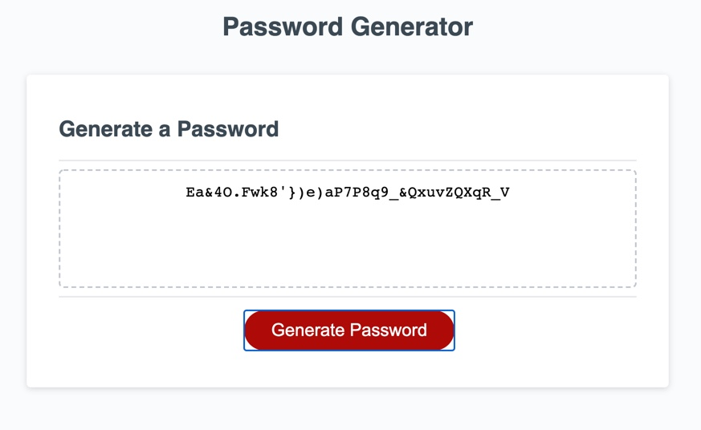
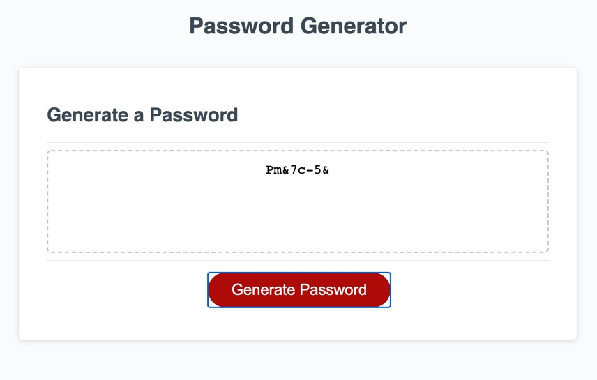
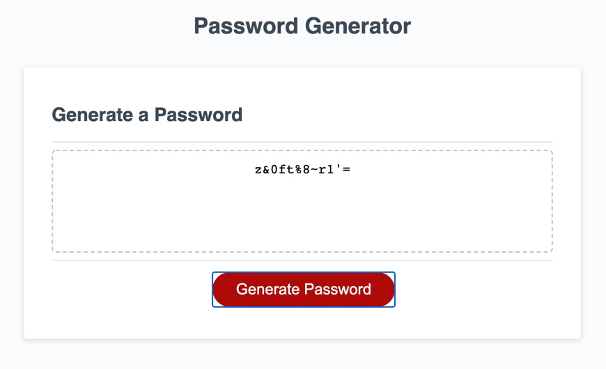
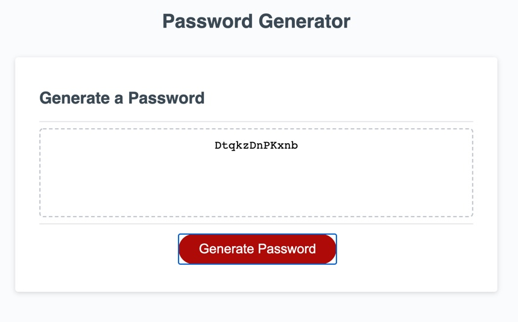

<!-- PROJECT INTRO -->
 

  

  <h3 align="center">Password Generator</h3>

  

    An awesome password generator to help you secure your information!
     
    <a href="https://github.com/heather-everton/PW-Gen-JS"><strong>Explore the docs »</strong></a>
     
     
    <a href="https://heather-everton.github.io/PW-Gen-JS/">View Demo</a>
    ·
    <a href="https://github.com/heather-everton/PW-Gen-JS/issues">Report Bug</a>
    ·
    <a href="https://github.com/heather-everton/PW-Gen-JS/issues">Request Feature</a>
  

<!-- TABLE OF CONTENTS -->
## Table of Contents

* [About the Project](#about-the-project)
  * [Built With](#built-with)
* [Getting Started](#getting-started)
* [Usage](#usage)
* [Roadmap](#roadmap)

<!-- ABOUT THE PROJECT -->
## About The Project

We all have to create passwords every day for various types of data and on top of that reset our passwords for the many applications we're running. Each application has different criteria for the type of passwords they need. Now you can generate a custom password each time for all your security needs. 

Here's why:
* Your time should be focused being productive not trying to come up with uniique passwords all the time.
* You shouldn't be using the same password for everything you access. 
* You should be able to pick exactly what type of password you need each time. 

A list of commonly used resources that I find helpful are listed in the acknowledgements.

### Built With
* [JavaScript](https://javascript.com)
* [html](https://html.com)
* [css](https://free-css.com)

<!-- GETTING STARTED -->
## Getting Started

To get started simply click on "Generate Password" and select the options for your perfect password.

<!-- USAGE EXAMPLES -->
## Usage

You can get long passwords for your most sensitive data. 

Or simple passwords for other applications. 

You can choose passwords with special characters and numbers.

Or ones with only letters. 

<!-- ROADMAP -->
## Roadmap

See the [open issues](https://github.com/heather-everton/PW-Gen-JS/issues) for a list of proposed features (and known issues).
